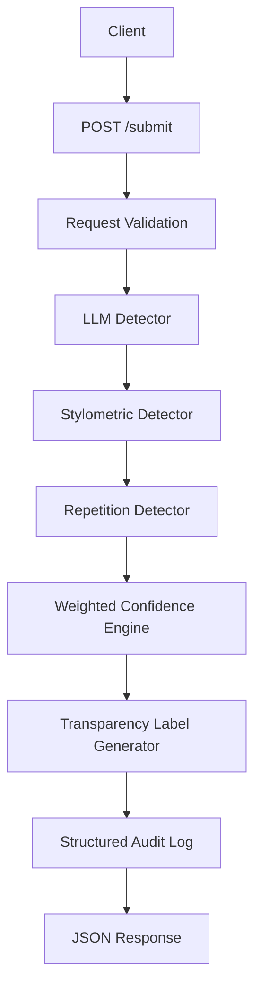

# Provenance Guard

## Overview

Provenance Guard is a production-oriented backend API that analyzes text submissions and estimates whether they 
are more likely to be AI-generated or human-written. Rather than making absolute claims, the system combines multiple 
independent detection signals into a confidence score, communicates uncertainty through transparent user-facing labels, 
and provides an appeals workflow for creators who believe their work has been misclassified.

The project emphasizes responsible AI engineering rather than perfect AI detection. Since attribution remains an 
unsolved research problem, the system is intentionally conservative and prioritizes transparency over overconfidence.

---

## Features

- Multi-signal AI attribution pipeline
- Weighted confidence scoring
- Three transparency label variants
- Appeals workflow
- Structured audit logging
- Rate limiting
- REST API endpoints
- JSON responses
- Modular detector architecture

---

## Architecture



The detection pipeline combines three independent signals because each captures a different property of writing. 
The LLM evaluates semantic coherence and overall writing style, the stylometric detector measures structural 
characteristics, and the repetition detector identifies repetitive language patterns commonly associated with 
generated text. Combining multiple independent signals produces more reliable decisions than relying on any single detector.

---

## Detection Signals

### 1. LLM Attribution (Primary Signal)

The primary detector uses Groq's Llama 3.3 70B Versatile model to evaluate whether writing appears more consistent with 
AI-generated or human-written language.

This detector captures semantic consistency, writing style, and overall fluency.

**Strengths**

- understands context
- recognizes stylistic patterns
- strongest signal in the pipeline

**Limitations**

- may confidently misclassify difficult cases
- dependent on prompt quality
- not deterministic across all writing styles

---

### 2. Stylometric Analysis

The stylometric detector measures structural properties of writing instead of meaning.

Features include:

- vocabulary diversity
- sentence-length variation
- lexical richness

These measurements are converted into an AI-likeness score.

**Strengths**

- deterministic
- inexpensive
- complements semantic analysis

**Limitations**

Formal writing, research papers, and carefully edited human work often resemble AI writing.

---

### 3. Repetition Detection

This detector measures repeated words and repeated sentence patterns.

Repeated structures frequently occur in generated text but can also appear naturally in speeches or poetry.

**Strengths**

- simple
- computationally inexpensive

**Limitations**

Cannot distinguish intentional repetition from generated repetition.

---

## Confidence Scoring

The three detection signals are combined into a weighted confidence score rather than forcing every submission
into a binary decision. The system intentionally reserves a broad uncertainty range to reduce false positives 
against human authors.

Each detector contributes differently to the final confidence score.

| Signal | Weight |
|--------|-------:|
| LLM Attribution | 70% |
| Stylometric Analysis | 20% |
| Repetition Detection | 10% |

The LLM receives the highest weight because semantic reasoning provides substantially richer information than
heuristic measurements, while the stylometric and repetition detectors provide supporting evidence for borderline cases.

### Example 1: Higher Confidence

**Input**

> "Artificial intelligence represents a transformative paradigm shift across modern society…"

**Confidence:** 69.5%

**Classification:** Uncertain

Although the LLM strongly favored AI-generated text, the stylometric and repetition detectors provided weaker
supporting evidence. Because the combined score remained below the 0.75 threshold, the system returned an Uncertain 
classification rather than making an overconfident attribution.

### Example 2: Lower Confidence

**Input**

> "I wrote this story myself after visiting Iceland."

**Confidence:** 52.5%

**Classification:** Uncertain

The semantic model suggested human authorship while the heuristic detectors produced mixed evidence. Rather than 
forcing a human or AI label, the system communicated that the available evidence was inconclusive.

These examples demonstrate that the confidence score varies meaningfully across different submissions while remaining
conservative when the evidence is insufficient to support a high-confidence attribution.

---

## Classification Thresholds

- **Likely Human:** confidence ≤ 0.35
- **Uncertain:** 0.35 < confidence < 0.75
- **Likely AI:** confidence ≥ 0.75

These thresholds intentionally bias the system toward caution to reduce false positives against human authors.

---

## Transparency Labels

**Likely AI**

> "Likely AI-generated. Our analysis found strong indicators that this content was generated using artificial 
> intelligence. This assessment was made with high confidence, but creators may appeal if they believe this decision 
> is incorrect."

**Likely Human**

> "Likely human-written. Our analysis found strong indicators of human authorship. While no automated system is 
> perfect, this content appears to have been written by a person."

**Uncertain**

> "Unable to determine confidently. The available evidence is mixed, so we cannot confidently classify this content 
> as either AI-generated or human-written. No definitive attribution has been made."

---

## API Endpoints

| Method | Endpoint | Purpose |
|--------|----------|---------|
| POST | `/submit` | Analyze submitted content |
| POST | `/appeal` | Submit an appeal |
| GET | `/log` | View structured audit log |
| GET | `/health` | Health check |
| GET | `/` | API status |

---

## Appeals Workflow

Creators who disagree with an attribution result may submit an appeal.

Each appeal contains:

- content ID
- creator explanation
- review status

Submitting an appeal changes the submission status to:

`under_review`

The original classification is preserved while the appeal becomes part of the audit history.

---

## Rate Limiting

The submission endpoint uses Flask-Limiter to reduce abuse.

**Configuration**

- 10 requests per minute
- 100 requests per day

These limits reflect typical creator usage while preventing automated flooding.

**Verification**

```
200
200
200
200
200
200
200
200
200
200
429
429
```

The final requests correctly returned HTTP 429, confirming that rate limiting is functioning.

---

## Audit Logging

Every submission creates a structured audit entry containing:

- timestamp
- content ID
- creator ID
- detector outputs
- confidence score
- transparency label
- submission status
- appeal information

This provides traceability and supports future manual review. Audit entries are stored as structured JSON records, 
making every classification and appeal easy to inspect during testing.

---

## Known Limitations

Perfect AI attribution remains an open research problem.

The current system may struggle with:

- highly edited AI-generated writing
- formal academic writing
- poetry and song lyrics
- non-native English writing
- collaborative human/AI writing

Future versions could incorporate larger ensembles, calibration techniques, additional stylometric features, and 
human verification workflows.

---

## Spec Reflection

Writing the architecture and confidence-scoring design before implementation significantly improved the overall 
organization of the project. Defining the API contract early made each milestone easier to implement because the 
responsibilities of each component were already clear.

During implementation, the confidence-scoring strategy evolved from a simple placeholder to a weighted ensemble 
after testing showed that a single detector was insufficient. This change better reflected the system's emphasis 
on combining independent evidence rather than relying on one model.

---

## AI Usage

**Instance 1**

I used ChatGPT to review my API design and discuss different ways to structure the Flask application before 
implementation. I compared the suggested approaches with my planned architecture, selected the parts that fit my 
design, and implemented and tested the final submission endpoint, routing, and project structure myself.

**Instance 2**

I used ChatGPT to evaluate confidence-scoring strategies, discuss detector weighting, identify potential edge cases,
and refine the wording of the transparency labels. After comparing multiple approaches, I adjusted the confidence 
thresholds, finalized the weighting strategy, and revised the generated suggestions to match the behavior of my implementation.

---

## Setup

Clone the repository.

```bash
git clone https://github.com/ditto-d/provenance-guard.git
```

Create a virtual environment.

```bash
python3 -m venv .venv
source .venv/bin/activate
```

Install dependencies.

```bash
pip install -r requirements.txt
```

Create a `.env` file containing your Groq API key.

```
GROQ_API_KEY=your_key_here
```

---

## Running the API

```bash
python app.py
```

The server starts at:

```
http://127.0.0.1:5000
```

---

## Future Improvements

Future iterations of Provenance Guard could include:

- ensemble models with additional attribution signals
- probability calibration
- reviewer dashboard
- analytics dashboard
- provenance certificates
- multilingual support
- multimodal attribution for images and documents

These additions would improve reliability while preserving the system's commitment to transparent AI attribution.